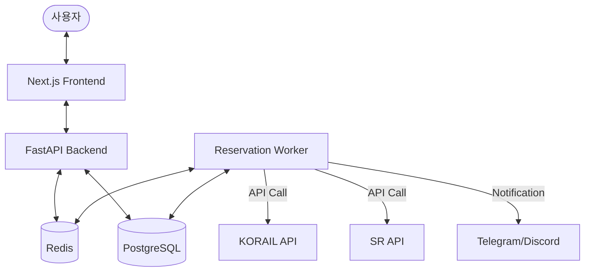

# 🚂 RailPass: Smart Railway Reservation System

RailPass는 SRT 및 KTX 열차 예매를 자동화하고 관리하기 위한 통합 플랫폼입니다. 사용자 친화적인 웹 인터페이스를 통해 열차를 검색하고, 조건에 맞는 열차가 없을 경우 백그라운드에서 자동으로 예매를 시도하는 기능을 제공합니다.

## 🏗 시스템 아키텍처



## 🛠 서비스 구성 요소

| 서비스 | 기술 스택 | 설명 |
| :--- | :--- | :--- |
| **Frontend** | Next.js, Tailwind CSS, Zustand | 사용자 인터페이스 및 대시보드 |
| **Backend** | FastAPI, SQLAlchemy, JWT | REST API 제공 및 작업 관리 |
| **Worker** | Python (Celery/Redis-based) | 실시간 열차 조회 및 자동 예매 수행 |
| **Database** | PostgreSQL | 사용자 정보, 계정, 예매 내역 저장 |
| **Cache/Queue** | Redis | 비동기 작업 큐 및 실시간 상태 정보 관리 |
| **Core Engine** | srtgo (Custom Python Library) | SRT/KTX API 연동 핵심 모듈 |

## 🚀 주요 워크플로우

### 1. 회원가입 및 계정 연동
- 사용자는 RailPass 서비스에 가입합니다.
- **[중요]** SRT/KTX 계정 정보를 시스템에 연동해야 자동 예매 기능을 사용할 수 있습니다.
- 모든 비밀번호 정보는 안전하게 암호화되어 저장됩니다.

### 2. 예매 작업 생성
- 사용자가 원하는 출발역, 도착역, 날짜, 시간대를 선택합니다.
- 자동 결제 여부 및 좌석 옵션을 설정합니다.
- '작업 시작'을 누르면 백그라운드 워커가 동작을 시작합니다.

### 3. 자동 예매 프로세스
- 워커는 설정된 주기에 따라 열차 잔여석을 조회합니다.
- 잔여석이 발견되면 즉시 예매를 시도합니다.
- 예매 성공 시 텔레그램 또는 디스코드를 통해 사용자에게 알림을 발송합니다.
- 자동 결제가 설정된 경우 연동된 카드로 결제까지 완료합니다.

## 💻 기술적 특징
- **비동기 작업 처리**: Redis 기반의 큐 시스템을 사용하여 수많은 사용자의 예매 요청을 병렬로 처리합니다.
- **실시간 상태 업데이트**: WebSocket을 통해 현재 예매 시도 횟수 및 상태를 대시보드에 실시간으로 표시합니다.
- **안티-봇 우회**: `curl_cffi`와 같은 고급 라이브러리를 사용하여 실제 모바일 앱의 네트워크 특성을 모방합니다. (JA3 핑거프린팅 대응)
- **보안**: AES-256 알고리즘을 사용하여 외부 서비스 계정 정보를 암호화 관리합니다.

## 📦 설치 및 구동 방법 (Docker 사용 권장)

### 사전 준비 사항
- [Docker](https://www.docker.com/) 및 [Docker Compose](https://docs.docker.com/compose/) 설치

### 1. 레포지토리 클론 및 환경 설정
```bash
git clone https://github.com/your-repo/RailPass.git
cd RailPass

# 환경 변수 설정
cp .env.example .env
# .env 파일을 열어 필요한 정보(DB 비밀번호, 텔레그램 토큰 등)를 수정하세요.
```

### 2. 서비스 실행
```bash
# 전체 서비스 빌드 및 실행
docker compose up --build -d
```

### 3. 접속 정보
- **Frontend**: `http://localhost:3000`
- **Backend API**: `http://localhost:8000`
- **Database**: `localhost:5432`

## ⌨️ CLI 직접 실행 (Web 없이 사용)

서버 환경에서 웹 인터페이스 없이 명령어로만 예약을 진행하고 싶은 경우, 내장된 `srtgo` CLI 도구를 사용하거나 직접 스크립트를 작성할 수 있습니다.

### 1. 내장 CLI 메뉴 사용
```bash
cd python
# 대화형 메뉴 실행
python run_srtgo.py
```
- 실행 후 `로그인 설정` -> `예매 시작` 메뉴를 통해 대화형으로 예약이 가능합니다.

### 2. Python 스크립트로 직접 제어 (`cli_example.py`)
웹 대시보드 없이 명령행 인자만으로 특정 열차를 타겟팅하여 예약할 수 있습니다. `python/cli_example.py`를 사용합니다.

**실행 명령어 예시:**
```bash
python python/cli_example.py \
  --id "1234567890" \
  --pw "password123" \
  --dep "수서" \
  --arr "부산" \
  --date "20240425" \
  --times "1400,1530,1700" \
  --seat "3" \
  --adult 2 \
  --senior 1
```

**주요 파라미터 설명:**
| 인자 | 설명 | 예시 |
| :--- | :--- | :--- |
| `--id` | SRT 멤버십 번호 (**필수**) | `1234567890` |
| `--pw` | SRT 비밀번호 (**필수**) | `mypassword` |
| `--dep` / `--arr` | 출발역 / 도착역 | `수서`, `동대구` |
| `--date` | 출발 날짜 (YYYYMMDD) | `20240420` |
| `--times` | 타겟팅할 열차 시간 (HHMM, 쉼표 구분) | `1400,1530` |
| `--seat` | 좌석 옵션 (1~4) | `1:일반우선, 2:일반전용, 3:특실우선, 4:특실전용` |
| `--adult` / `--senior` | 인원수 (성인 / 경로) | `--adult 2 --senior 1` |

- `--times`를 입력하지 않으면 조회된 목록에서 수동으로 선택할 수 있는 메뉴가 나타납니다.
- 프로그램은 좌석이 확보될 때까지 지정된 간격으로 무한 루프를 돌며 시도합니다.

## 🧪 로컬 개발 환경 설정 (Non-Docker)

### Backend 설정
1. Python 3.12 이상 설치
2. `cd backend`
3. `python -m venv venv && source venv/bin/activate`
4. `pip install -r requirements.txt`
5. `uvicorn app.main:app --reload`

### Frontend 설정
1. Node.js 18 이상 설치
2. `cd frontend`
3. `npm install`
4. `npm run dev`

---
*주의: 이 프로그램은 개인적인 편의를 위해 제작되었으며, 과도한 요청은 철도 공사 서비스에 부담을 줄 수 있습니다. 정당한 권한 내에서 사용하시기 바랍니다.*
